<p align="center">
  
</p>

# FinanceCantorDust

A full-stack **finance and accounting dashboard** for recording transactions, organizing accounts and parties, producing reports, and exporting financial data.

This project goes beyond a basic expense tracker by introducing accounting-oriented concepts such as a chart of accounts, journals, opening balances, and categorized transactions.

## Main modules

The current frontend includes protected routes for:

- Dashboard
- Transactions
- Reports
- Parties
- Categories
- Chart of Accounts
- Opening Balances
- Journal Entries
- Export

The backend provides APIs for:

- authentication
- transactions
- reports
- parties
- exports
- categories
- accounts
- journals

## Tech stack

**Frontend:** React 19, Vite, React Router, Tailwind CSS 4, Axios, Recharts, XLSX  
**Backend:** Node.js, Express, MongoDB, Mongoose, JWT, bcryptjs  
**Files / export:** ExcelJS, Multer, Cloudinary

## Architecture

```text
Authenticated React dashboard
        │
        ├─ transactions
        ├─ parties + categories
        ├─ chart of accounts
        ├─ opening balances
        ├─ journal entries
        ├─ reports
        └─ exports
        │
Express API + auth middleware
        │
MongoDB
```

## Repository structure

```text
FinanceCantorDust/
├── financeFrontend/
│   └── frontend/       # React/Vite application
├── financeServer/      # Express/MongoDB API
├── User_Guide.docx
└── repomix-output.xml
```

## Run locally

Backend:

```bash
cd financeServer
npm install
npm run dev
```

Frontend:

```bash
cd financeFrontend/frontend
npm install
npm run dev
```

Local environment variables are required for database/auth configuration and any Cloudinary-backed upload functionality.

## What I learned

The main value of this build was moving from ordinary CRUD into **financial domain modeling**: accounts, journals, balances, reports, exports, protected workflows, and the relationships between them.

## Status

**Archive / learning project.** Useful as a record of my earlier accounting-system work; production use would require a fresh review of financial correctness, authorization boundaries, validation, and tests.

---

**Sanam Rai** · [GitHub profile](https://github.com/SanamRai001)
